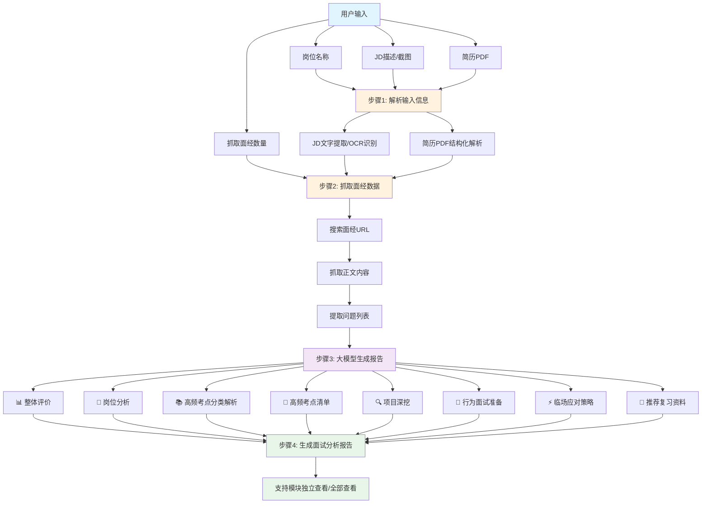
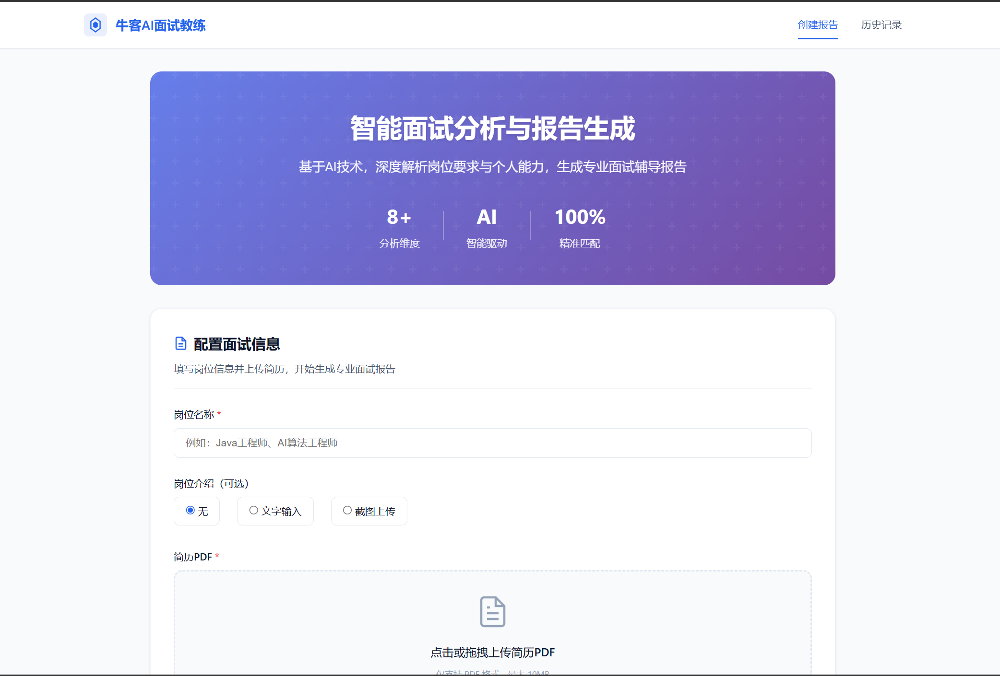
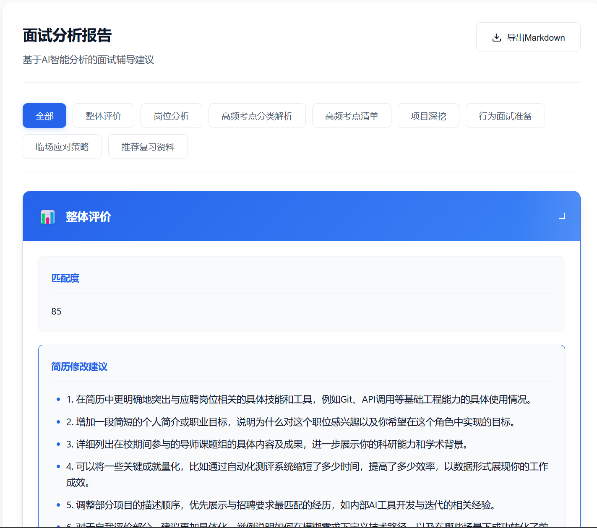
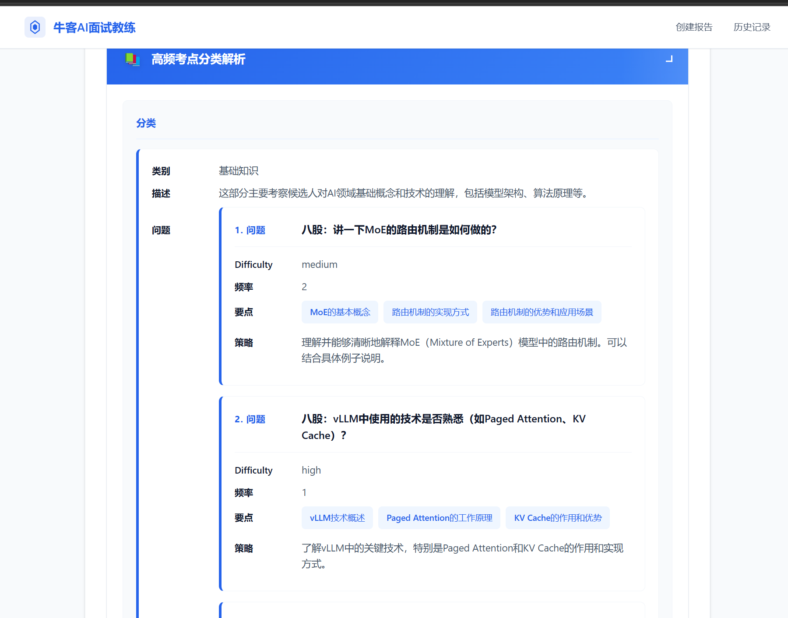

# 🎯 牛客AI面试教练

> 用 AI 对抗 AI，用技术反哺成长。

## 📖 项目背景

不知道你有没有发现，现在找工作越来越"魔幻"了。

投个简历，HR 不面你，先让 AI 面；笔试还没做，AI 先给你打个分。好家伙，我连面试官的面都没见着，就被 AI 给刷了。

说实话，我觉得现在的 AI 也没那么"超级智能"，但用它来卡人倒是挺利索的。

找实习那会儿，我每次看到一个心仪的岗位，都得这么折腾一遍：
1. 把岗位介绍复制给 DeepSeek，让它帮我分析这个岗位到底要什么人
2. 再把我的简历丢进去，让它看看我匹配度怎么样
3. 最后让它帮我预测可能会问的面试题，一个个准备答案

一套下来，大半天就没了。换个岗位，再来一遍。

我就在想，既然企业能用 AI 来筛人，那我为什么不能用 AI 来武装自己？

**用魔法打败魔法，不过分吧？**

于是我就做了这个 AI 面试教练系统——把那些重复的、麻烦的活儿全交给它。你只需要告诉它岗位是什么、简历在哪里，它就能自动帮你分析面经、预测问题、生成准备报告。

这个想法挺朴素的，但很实在——**既然 AI 面试已经是趋势，那就让它成为我的私人教练**。

---

## 🔄 功能流程图



> 💡 如果流程图无法显示，可以使用支持 Mermaid 的 Markdown 编辑器查看（如 Typora、GitHub、VS Code 等）

---

## 📸 效果图






---

## 🚀 核心功能详解

### 1️⃣ 智能面经抓取与分析
- 自动从牛客网搜索目标岗位的历史面经
- 智能提取面经中的面试问题与经验总结
- 支持自定义抓取数量（1-50篇）
- 内置反爬机制，请求间隔 ≥ 1 秒，失败自动重试

### 2️⃣ 简历深度解析
- 支持 PDF 格式简历一键上传
- 结构化解析，为后续分析提供数据基础

### 3️⃣ JD 智能识别
- 支持文字描述直接输入
- 支持 JD 截图 OCR 识别（jpg/png/webp）
- 自动提取岗位要求、技术栈、软技能要求

### 4️⃣ 个性化面试报告生成
基于 **岗位信息 + 简历内容 + 历史面经**，通过阿里百炼大模型智能生成 8 大模块报告：

| 模块 | 说明 |
|------|------|
| 📊 **整体评价** | 基于简历与岗位的匹配度总评，含简历修改建议 |
| 💼 **岗位分析** | 岗位核心要求、技术栈、软技能要求、发展方向 |
| 📚 **高频考点分类解析** | 按面试维度（基础、算法、项目、行为等）分类 |
| 📝 **高频考点清单** | 具体问题列表 + 回答要点 + 示例回答 |
| 🔍 **项目深挖** | 针对简历项目的追问预测与准备建议（重中之重） |
| 🤝 **行为面试准备** | HR终面常见问题及 STAR 回答框架 |
| ⚡ **临场应对策略** | 压力问题、不会回答时的应对技巧 |
| 📖 **推荐复习资料** | 书籍、网站、课程、面经链接等 |

### 5️⃣ 断点续传支持
- 长流程任务自动保存进度
- 支持从任意步骤恢复执行
- 避免因网络或异常导致重复执行

### 6️⃣ Web 可视化界面
- 简洁美观的 Web 操作界面
- 实时显示任务执行进度
- 支持报告模块独立查看
- 支持导出 Markdown 格式报告

---

## 🛠️ 如何使用

### 环境准备

#### 1. 安装依赖
```bash
pip install -r requirements.txt
```

#### 2. 配置环境变量
复制 `.env.example` 为 `.env`，并填入你的配置信息：
```bash
cp .env.example .env
```

`.env` 文件内容：
```env
DASHSCOPE_API_KEY=your_api_key_here
NOWCODER_COOKIE=your_nowcoder_cookie_here
```

**如何获取配置项：**

| 配置项 | 说明 | 获取方式 |
|--------|------|----------|
| `DASHSCOPE_API_KEY` | 阿里百炼 API 密钥 | 前往 [阿里百炼控制台](https://bailian.console.aliyun.com/) 创建并获取 |
| `NOWCODER_COOKIE` | 牛客网登录 Cookie | 见下方详细教程 |

**获取牛客网 Cookie 教程：**

1. 打开浏览器，访问 [牛客网](https://www.nowcoder.com) 并登录
2. 按 `F12` 打开开发者工具（或右键 → 检查）
3. 切换到 **Network（网络）** 标签页
4. 刷新页面（`F5`）
5. 在请求列表中找到任意一个 `nowcoder.com` 的请求
6. 点击该请求，在右侧找到 **Headers（请求头）** → **Request Headers（请求标头）**
7. 找到 `cookie` 字段，复制其完整值
8. 粘贴到 `.env` 文件的 `NOWCODER_COOKIE=` 后面

> ⚠️ **注意**：Cookie 有有效期，如果爬虫失效，请重新获取 Cookie。请勿将 Cookie 提交到公开代码库。

### 使用方式

#### 方式一：命令行使用

```bash
python main.py --position "AI算法工程师" --resume "resume.pdf" --count 20
```

**完整参数说明：**

| 参数 | 说明 | 必填 | 示例 |
|------|------|------|------|
| `--position` | 岗位名称 | ✅ | `"Java开发工程师"` |
| `--resume` | 简历 PDF 路径 | ✅ | `"my_resume.pdf"` |
| `--jd-text` | 岗位描述文字 | ❌ | `"要求熟悉Spring框架..."` |
| `--jd-image` | JD 截图路径 | ❌ | `"jd_screenshot.png"` |
| `--count` | 抓取面经数量 | ❌ | `20`（默认10，范围1-50） |

**使用示例：**

```bash
# 基础使用
python main.py --position "前端开发工程师" --resume "resume.pdf"

# 带 JD 描述
python main.py --position "后端开发" --jd-text "要求熟悉MySQL、Redis..." --resume "resume.pdf" --count 30

# 带 JD 截图
python main.py --position "算法工程师" --jd-image "jd.png" --resume "resume.pdf"

# 断点续传
python main.py --position "AI工程师" --resume "resume.pdf" --workflow-id "workflow_123" --resume-workflow
```

#### 方式二：Web 界面使用

```bash
python app.py
```

启动后访问：`http://localhost:5000`

**操作步骤：**
1. 上传你的简历 PDF
2. 输入目标岗位名称
3. （可选）输入 JD 描述或上传 JD 截图
4. 设置抓取面经数量
5. 点击"生成报告"
6. 等待生成完成，查看各模块内容
7. 支持导出 Markdown 格式报告

---

## 📁 项目结构

```
niuke-ai-coach/
├── main.py                 # 命令行入口
├── app.py                  # Web 服务入口
├── requirements.txt        # Python 依赖
├── .env.example            # 环境变量模板
├── .gitignore
│
├── src/                    # 核心业务代码
│   ├── workflow.py         # 主工作流编排
│   ├── state_manager.py    # 状态管理与断点续传
│   ├── logger.py           # 日志模块
│   └── tools/
│       ├── niuke.py        # 牛客网爬虫工具
│       ├── llm.py          # 阿里百炼大模型调用
│       ├── resume.py       # 简历解析工具
│       └── jd.py           # JD 识别工具
│
├── templates/              # Web 模板
│   └── index.html
├── static/                 # 静态资源
│   ├── css/style.css
│   └── js/app.js
│
├── docs/                   # 功能流程说明
│   └── workflows.md
├── harness/                # 工程约束定义
│   ├── rules.md
│   ├── schemas.md
│   └── state.md
│
└── test/                   # 测试代码
    └── run_tests.py
```

---

## ⚙️ 技术栈

| 类别 | 技术 |
|------|------|
| 编程语言 | Python 3.8+ |
| AI 模型 | 阿里百炼 DashScope API |
| Web 框架 | Flask |
| 简历解析 | PDF 文本提取 |
| 爬虫 | Requests + BeautifulSoup |
| 状态管理 | 本地 JSON 文件 |

---

## ⚠️ 注意事项

1. **API 密钥安全**：所有敏感信息从环境变量读取，切勿硬编码或提交到代码库
2. **爬虫限速**：牛客网请求间隔 ≥ 1 秒，请遵守网站爬虫规范
3. **文件限制**：简历 PDF 大小 ≤ 10MB，JD 截图支持 jpg/png/webp 格式
4. **网络要求**：需要能够访问 `nowcoder.com` 和阿里百炼 API
5. **断点续传**：长流程任务建议记录 workflow-id，便于异常恢复

---

## 📝 报告输出示例

生成的报告以 JSON 格式保存在 `data/reports/` 目录下，可通过 Web 界面查看或导出为 Markdown 格式。

报告包含以下核心内容：
- 岗位匹配度评分与简历优化建议
- 高频面试问题清单及答题要点
- 简历项目深挖与预测追问
- 行为面试 STAR 回答框架
- 临场压力问题应对策略
- 推荐学习资源与复习资料

---


### 💬 写在最后

说实话，这个项目还有很多不完美的地方。最近刚找到实习，白天上班晚上改代码，精力确实有限。生成的报告内容质量我觉得还有提升空间，后面有空了我打算把报告生成逻辑重新梳理一下，设计一些更精细的工作流，让输出更靠谱。

做这个的初衷特别简单——就是我自己找工作的时候觉得麻烦，想搞个工具帮自己省点事。后来想想，应该有不少小伙伴也在为面试头疼，干脆就开源出来，说不定能帮到一些人。

如果你用了觉得还行，麻烦给个 Star ⭐ 鼓励一下！要是有什么想法或者建议，随时提 Issue，咱们一起聊聊。

找工作这事儿挺熬人的，但别慌，咱们一起加油 💪

---


> 💡 **用 AI 对抗 AI，用技术反哺成长** —— 让每一次面试都成为成长的契机。
